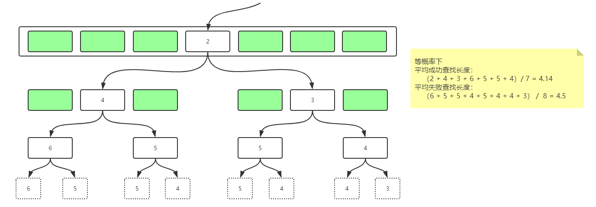

# 数据结构与算法-向量vector

​		数组是一组具有相同类型的数据，存储在连续的内存空间中。


## 一、简介

​		向量（vector）是数组的抽象与泛化，由一组元素按线性次序封装完成。很多语言中都有提供容器类

，如C++ STL 中的 vector，Java 中的 ArrayList。与链表、栈、队列一样，向量属于线性表结构。


## 二、部分操作

​		基于vector的算法有很多，此处简单记录几个有意思的。另外，篇幅有限，且许多排序算法可被向量与链表共用，后面单独细说。


### 2.1 访问

​		与数组一样，向量是存储在连续内存空间具有相同类型的数据（向量内部的数据存储正式以数组方式实现的），正因如此，向量的随机访问非常高效。只需知道a[0]的物理地址A，单个元素占用空间s和要访问的数据下标i，便可直接计算出

```
a[i]的物理地址 = A + i * s
```

，因此可以实现O(1)时间的随机访问。向量中各个元素下标称为秩，因此向量是循秩访问。

​		不仅如此，当CPU在需要获取数据时，先在CPU缓存中查找，如果查找不到再到内存中查找。而CPU从内存中读取数据时并不是仅仅读取要访问的地址，而是读取一个数据块并保存至缓存中。例如，此时CPU需要读取a[2]，但是缓存中没有，于是到内存中查找。找到之后，CPU不仅将a[2]读至缓存，可能连a[1]、a[0]、a[3]、a[4]等一起读入缓存。当CPU需要读取a[4]时，可以直接从缓存内查到。读取速度就有了很大提升，这是链表等数据结构没有的特性。


### 2.2 查找

#### 2.2.1 遍历查找

​		要实现查找功能，向量中存储的数据类型要有判等的能力，如在java中需实现equals方法。java的ArrayList中提供两种查找方法，一种是从前往后遍历，找到第一次出现的位置，另一种是从后向前遍历，找到最后一次出现的位置。算法复杂度为O(n)。代码如下。

```java
/**
 * Returns the index of the first occurrence of the specified element
 * in this list, or -1 if this list does not contain the element.
 * More formally, returns the lowest index <tt>i</tt> such that
 * <tt>(o==null&nbsp;?&nbsp;get(i)==null&nbsp;:&nbsp;o.equals(get(i)))</tt>,
 * or -1 if there is no such index.
 */
public int indexOf(Object o) {
    if (o == null) {
        for (int i = 0; i < size; i++)
            if (elementData[i]==null)
                return i;
    } else {
        for (int i = 0; i < size; i++)
            if (o.equals(elementData[i]))
                return i;
    }
    return -1;
}
/**
 * Returns the index of the last occurrence of the specified element
 * in this list, or -1 if this list does not contain the element.
 * More formally, returns the highest index <tt>i</tt> such that
 * <tt>(o==null&nbsp;?&nbsp;get(i)==null&nbsp;:&nbsp;o.equals(get(i)))</tt>,
 * or -1 if there is no such index.
 */
public int lastIndexOf(Object o) {
    if (o == null) {
        for (int i = size-1; i >= 0; i--)
            if (elementData[i]==null)
                return i;
    } else {
        for (int i = size-1; i >= 0; i--)
            if (o.equals(elementData[i]))
                return i;
    }
    return -1;
}
```


#### 2.2.2 减而治之

​		但对于有序向量来说，遍历查找浪费了有序这一特性。对于有序向量，可采用减而治之策略，即：以任一元素m = a[mi]为界，都可将待查找区间分为三部分，a[lo, mi) <= a[mi] <= a(mi, hi]。只要将目标元素t与m进行比较，就可分为三种情况进一步处理：

- t > m : t若存在，必处于右侧子区间a(mi, hi]中
- t < m : t若存在，必处于左侧子区间a[lo, mi)中
- t = m : 返回


​		关于mi的取值，可选取中点，称为二分策略，每经过至多两次比较，或者返回，或者将原问题规模减半。java的Arrays中提供了二分查找算法的实现方式，T(n) = T(n / 2) + O(1) = O(log n)。

```java
private static int binarySearch0(Object[] a, int fromIndex, int toIndex,
                                 Object key) {
    int low = fromIndex;
    int high = toIndex - 1;
    while (low <= high) {
        int mid = (low + high) >>> 1;
        @SuppressWarnings("rawtypes")
        Comparable midVal = (Comparable)a[mid];
        @SuppressWarnings("unchecked")
        int cmp = midVal.compareTo(key);
        if (cmp < 0)
            low = mid + 1;
        else if (cmp > 0)
            high = mid - 1;
        else
            return mid; // key found
    }
    return -(low + 1);  // key not found.
}
```


​		二分查找相对于遍历查找优化很多，但此处实现仍可以继续优化。

​		为了更加精细地评估查找算法的性能，可以考察查找长度，即考察关键码的比较次数。可以发现，二分查找中转向左右分支前关键码比较次数不等，递归深度却是相同。此处成功、失败时的平均查找长度大致为O(1.5 * log n)。




解决问题思路：

1. 修改mi取值策略，通过使递归深度的变化弥补比较次数的差异，如斐波那契查找；
2. 改进二分查找算法实现，使比较次数相等。如下所示。

```java
private static int binarySearch(Object[] a, int fromIndex, int toIndex, Object key) {
    int low = fromIndex;
    int high = toIndex - 1;
    while (low <= high) {
        int mid = (low + high) >>> 1;
        @SuppressWarnings("rawtypes")
        Comparable midVal = (Comparable)a[mid];
        @SuppressWarnings("unchecked")
        int cmp = midVal.compareTo(key);
        cmp > 0 ? high = mid : low = mid + 1;
    }
    return --low;  // key not found.
}
```


### 2.3 扩容

​		数组需要分配连续的内存空间，因此在定义时要预先指定大小。如果要存储的数据量超出数组的容量，需要分配一块更大的空间并把原来的数据复制过去，再插入新数据。而向量已经为我们封装好了动态扩容这一操作。常见的策略有两种：

- 容量递增
- 容量加倍


​		采用容量加倍策略可减少扩容次数。下面是java中ArrayList与Vector扩容实现，但都没有考虑到缩容。

​		java中ArrayList扩容实现，存储空间不够时会将空间自动扩容为 1.5 倍大小。

```java
/**
 * Increases the capacity to ensure that it can hold at least the
 * number of elements specified by the minimum capacity argument.
 *
 * @param minCapacity the desired minimum capacity
 */
private void grow(int minCapacity) {
    // overflow-conscious code
    int oldCapacity = elementData.length;
    int newCapacity = oldCapacity + (oldCapacity >> 1);
    if (newCapacity - minCapacity < 0)
        newCapacity = minCapacity;
    if (newCapacity - MAX_ARRAY_SIZE > 0)
        newCapacity = hugeCapacity(minCapacity);
    // minCapacity is usually close to size, so this is a win:
    elementData = Arrays.copyOf(elementData, newCapacity);
}
```


​		而java内Vector的实现稍有不同。Vector构造方法中重载了可指定增量的方法。若开发者创建对象时指定capacityIncrement值大小并且该值为正数，Vector扩容时便是容量递增的策略，否则便是容量加倍。

```java
public Vector(int initialCapacity, int capacityIncrement) {
    super();
    if (initialCapacity < 0)
        throw new IllegalArgumentException("Illegal Capacity: "+
                                           initialCapacity);
    this.elementData = new Object[initialCapacity];
    this.capacityIncrement = capacityIncrement;
}

private void grow(int minCapacity) {
    // overflow-conscious code
    int oldCapacity = elementData.length;
    int newCapacity = oldCapacity + ((capacityIncrement > 0) ?
                                     capacityIncrement : oldCapacity);
    if (newCapacity - minCapacity < 0)
        newCapacity = minCapacity;
    if (newCapacity - MAX_ARRAY_SIZE > 0)
        newCapacity = hugeCapacity(minCapacity);
    elementData = Arrays.copyOf(elementData, newCapacity);
}
```


​		不过，扩容操作设计内存申请和数据移动，比较耗时。预先指定大小可以省掉很多次内存申请和数据移动。


### 2.4 插入与删除

​		插入与删除算法，可能涉及到批量的数据移动，复杂度为O(n)。批量删除操作时，不要挨个进行删除操作，即假如现在要删除[2,4]中元素，可直接将第5个及其后面的元素前移，覆盖[2,4]内旧元素，这样只会进行一次数据迁移。不要先删除第2个元素，再删除第3个元素等等，如此相当于进行多次的数据迁移。


​		java中的实现简单粗暴，核心只有一句：

```java
System.arraycopy(elementData, index, elementData, index + 1, size - index);
```


​		另外，若向量插入数据过程中并不在意数据的顺序，可将待插入位置的数据移至尾部，然后将待插入数据直接替换该位置的原数据，这一过程仅对两个数据进行操作，复杂度降为O(1)。

​		同样的，在删除某个位置上数据后，为保持内存连续，需要搬移数据。但如果对内存连续性要求不高时，在每一次的删除操作中，记录下被删除的数据位置，直到向量空间不足时批量进行一次删除操作，如此可减少删除操作产生的频繁的数据迁移，复杂度降为O(1)，如jvm的垃圾回收机制的标记-清除算法。