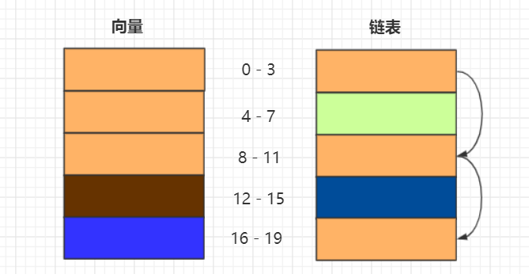
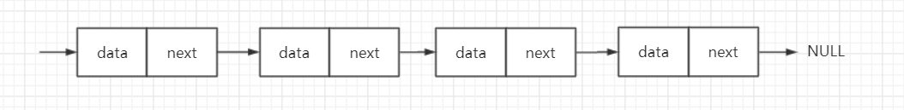
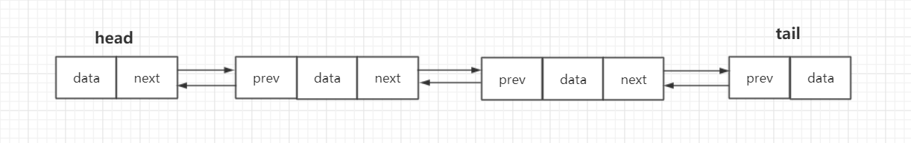
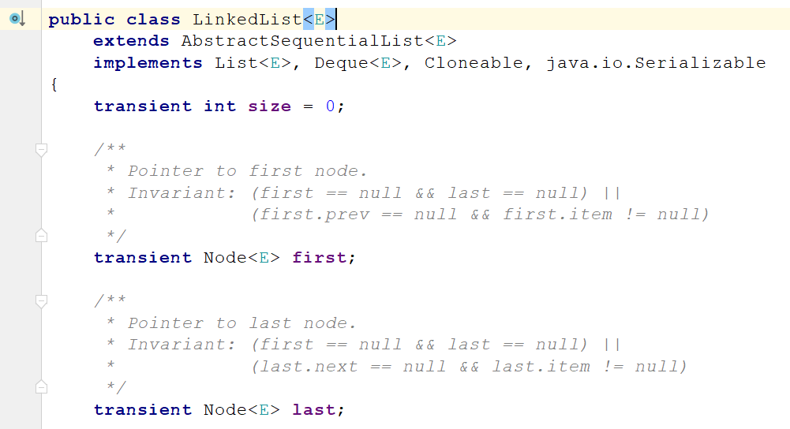
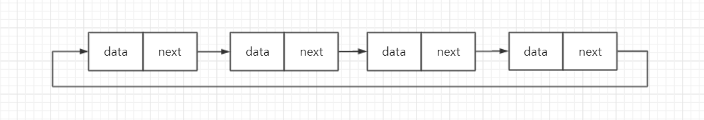
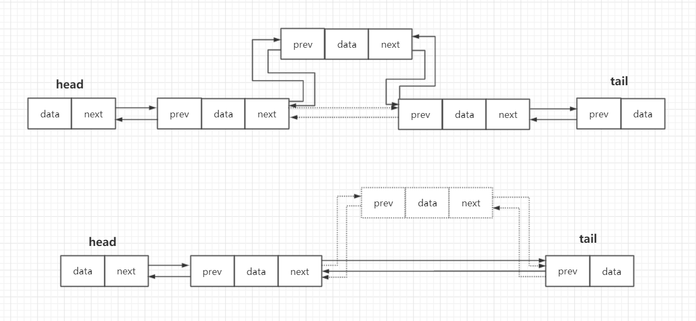
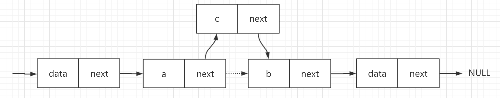

# 数据结构与算法-链表list

​		数据元素的存储与组织方式有两种，分别是静态与动态。静态存储方式，如向量，数据空间整体创建或销毁，各个元素物理存储次序与逻辑次序严格一致，从而可支持高效的静态操作，如访问、查找等。而动态存储方式，各个元素的物理空间需动态的分配和回收，相邻元素的物理地址未必相邻，只是在逻辑上形成次序，从而可支持高效的动态操作，如添加、删除等。


## 一、简介

​		链表（list）是采用动态存储策略的典型结构。链表中的元素称为节点（node），相邻节点彼此互称前驱或后继，通过节点间的引用关系在逻辑上构成一个线性序列。前驱或后继若存在，则唯一，没有前驱的唯一节点称为首节点，没有后继的唯一节点称为末节点。

​		从存储结构对比来看，如上所述，向量需要一块连续的内存空间来存储，对内存的要求比较高。当内存中没有连续的、足够大的存储空间时，即便内存的剩余总可用空间非常大，仍然会申请失败。而链表恰恰相反，它并不需要一块连续的内存空间，它通过节点引用将一组零散的内存块串联起来使用，所以在相同情况下并不会有问题，同时这样的存储策略也使得链表天然的支持动态扩容。

​		当然，这也就意味着链表对CPU缓存不友好。另外，链表需要存储指向下一节点的引用，对内存消耗更大，还有频繁的插入删除操作会导致频繁的内存申请与释放，容易造成内存碎片，在java中便会引起频繁的垃圾回收。




​		链表的结构有很多种，此处挑选三种简单常见的结构，分别是单链表、双向链表和循环链表。


### 1.1 单链表

​		单链表中第一个节点（首节点）和最后一个节点（末节点）比较特殊。其中，首节点用来记录链表的基地址。通过它可以遍历整条链表。而末节点不是指向下一个节点，而是指向一个空地址 NULL，表示这是链表上最后一个节点。




### 1.2 双向链表

​		比起单链表，双向链表需要额外的空间存储前驱节点的地址，占用更多的内存空间。但前驱节点引用的加入使得双向链表支持双向遍历，可以在O(1)的时间复杂度下找到前驱节点。基于此，双向链表在某些情况下的插入、删除等操作都要比单链表简单、高效，如删除某个节点的前驱节点等。




​		单链表向双向链表的变化正是典型的空间换时间的思想，为了提高操作效率，牺牲一些内存空间也是可以的。在jdk1.8中，LinkedList、LinkedHashMap等具有链表结构的容器类中都是基于双向链表实现的。




### 1.3 循环链表

​		当单链表的末节点不再指向空地址NULL而是指向首节点，就构成了循环链表。因此循环链表的特点就是从链尾到链头比较方便。当要处理的数据具有环型结构特点时，就特别适合采用循环链表。比如著名的约瑟夫问题。




## 二、部分操作

### 2.1 访问

​		链表的存储方式决定了它无法像向量循秩访问那么高效，链表改用循位置访问的方式，即利用节点之间的相互引用从而找到指定的节点。同时也意味着纵然是在有序链表中也无法实现二分查找这样的高效查找算法。（不过，skiplist可以兼顾两种访问方式，以后有空单独再提。）


### 2.2 插入与删除

​		链表中，插入与删除操作复杂度均为O(1)，但需要注意的是，此处指的仅仅是操作本身。例如，若要删除值等于3的节点，首先需要遍历找到值为3的节点所在位置，这样的话查找操作的复杂度便需要O(n)。

​		插入与删除操作如下图所示（此处以双向链表为例）。




### 2.3 算法设计留意点

​		插入与删除算法中，或者说多数链表相关算法中，需要特别留意以下几点：

#### 	1. 警惕引用丢失和内存泄漏

​		链表中各节点通过引用相互关联，引用操作不当便会丢失数据，此处以简单的单链表插入操作为例。




​		例如上图，在相邻节点a、b间插入c节点，代码如下：

```python
a.next = c
c.next = a.next//此时a.next指向c,c.next指向c,b节点及其后续节点访问不到了
```

​		可见，插入节点时，一定要注意操作的顺序。不仅如此，链表操作中，需时时明确引用指向的对象。画些草图可以帮助理解推导。


#### 	2. 留意边界条件处理

​		譬如，链表判空的条件；链表为空时代码是否正常；链表仅有一个节点时代码是否正常；链表仅有两个节点时代码是否正常；在处理首节点和末节点的时候是否正常等等。


#### 	3. 利用哨兵简化实现难度

​		之前的双向链表示意图中，head与tail就分别表示头哨兵节点与尾哨兵节点。哨兵节点是不存储数据的。因为哨兵节点一直存在，一些边界情况处理便可忽略。例如，插入第一个节点和插入其他节点，删除最后一个节点和删除其他节点，都可以统一为相同的代码实现逻辑了。

​		同样以jdk1.8中的LinkedList为例，以下是从链表中删除某个节点的代码。此处并没有利用哨兵实现，first与last分别用来指向链表的首节点和末节点。当链表为空时，first与last指向相同，即first = last。

```java
E unlink(Node<E> x) {
    // assert x != null;
    final E element = x.item;
    final Node<E> next = x.next;
    final Node<E> prev = x.prev;

    if (prev == null) {	//判断x是否为首节点
        first = next;
    } else {
        prev.next = next;
        x.prev = null;
    }

    if (next == null) {	//判断x是否为尾节点
        last = prev;
    } else {
        next.prev = prev;
        x.next = null;
    }

    x.item = null;
    size--;
    modCount++;
    return element;
}
```


​		在加入哨兵之后，first与last分别用来指向链表的头节点和尾节点。当链表为空时，first与last指向彼此，即first.next = last，last.prev = first。代码得以简化为如下。

```java
E unlink(Node<E> x) {
    // assert x != null;
    final E element = x.item;
    final Node<E> next = x.next;
    final Node<E> prev = x.prev;

    prev.next = next;
    x.prev = null;
    next.prev = prev;
    x.next = null;

    x.item = null;
    size--;
    modCount++;
    return element;
}
```


​		可以发现，引入哨兵机制不仅能简化实现难度，还更加便于理解。此处仅仅是简单的删除操作，在涉及到复杂算法时哨兵的优势会更加明显。


## 三、链表应用-LRU缓存

​		虽然在工作中很少使用链表这一数据结构，但个人十分喜欢它操作的灵活性，在和其他数据结构配合使用时也是十分方便。例如，可以通过双链表与散列表实现高效的LRU缓存，这也是一种空间换时间的策略，此处我用python简单实现分享一下。


```python
class Node:
    def __init__(self, key, value):
        self.key = key
        self.value = value
        self.next = None
        self.pre = None

class LinkedList:
    def __init__(self):
        self.tail = self.head = Node(None, None)
        self.head.next = self.tail
        self.tail.pre = self.head

    def addFirst(self, key, value):
        node = Node(key, value)
        self.head.next.pre = node
        node.next = self.head.next
        node.pre = self.head
        self.head.next = node
        return node

    def removeLast(self):
        node = self.tail.pre
        key = node.key
        node.pre.next = node.next
        node.next.pre = node.pre
        node = None
        return key
        
    def resetValuePosi(self, node):
        node.pre.next = node.next
        node.next.pre = node.pre
        node.next = self.head.next
        node.next.pre = node
        node.pre = self.head
        self.head.next = node

class LRU_Cache(object):

    def __init__(self, capacity):
        # Initialize class variables
        self.capacity = capacity
        self.size = 0
        self.dict = {}
        self.linkedList = LinkedList()

    def get(self, key):
        # Retrieve item from provided key. Return -1 if nonexistent. 
        node = self.dict.get(key)
        if node == None:
            return -1
        else:
            self.linkedList.resetValuePosi(node)
            return node.value

    def set(self, key, value):
        # Set the value if the key is not present in the cache. If the cache is at capacity remove the oldest item. 
        if key in self.dict.keys():
            node = self.dict[key]
            node.value = value
            self.linkedList.resetValuePosi(node)
        else:
            if self.size == self.capacity:
                del self.dict[self.linkedList.removeLast()]
            else:
                self.size += 1
            self.dict[key] = self.linkedList.addFirst(key, value)
```

