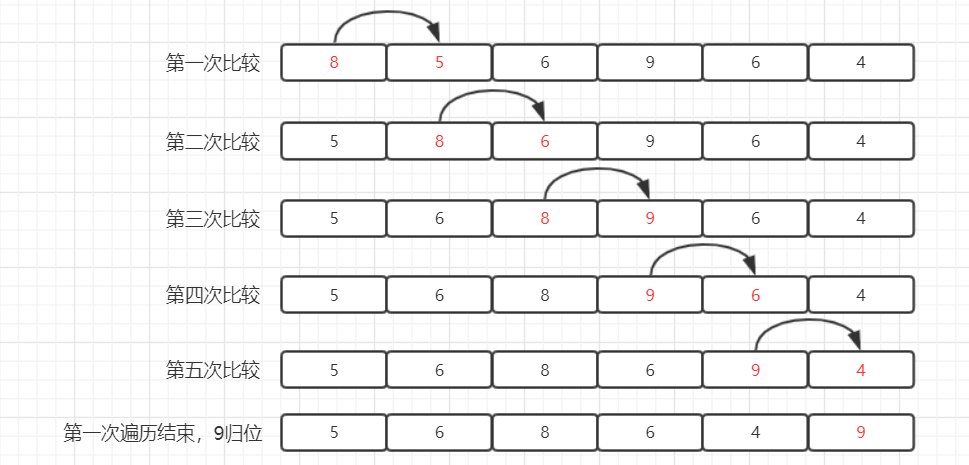
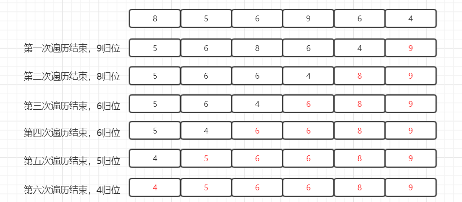
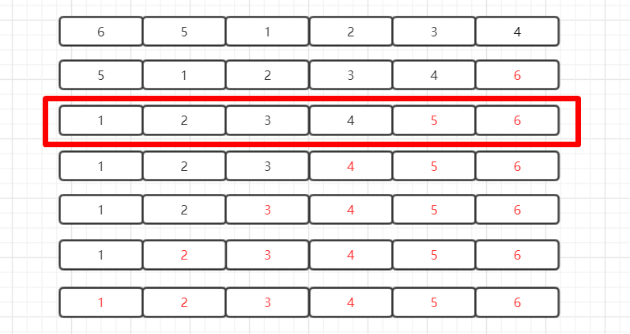
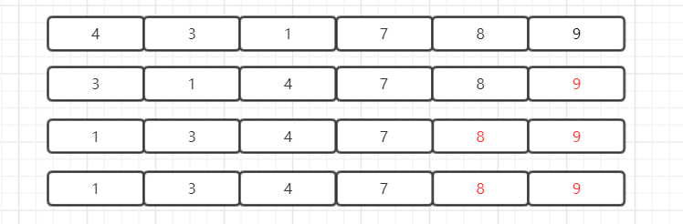
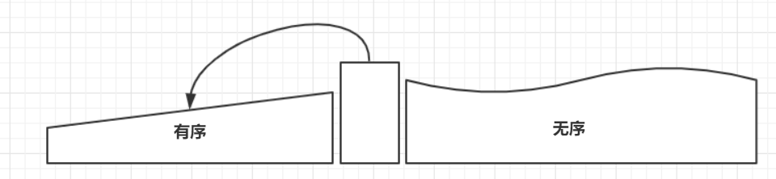
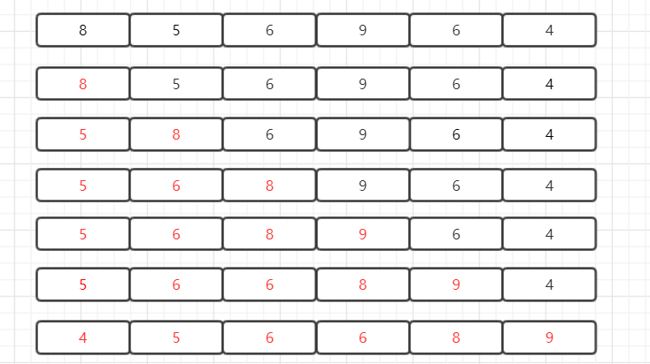
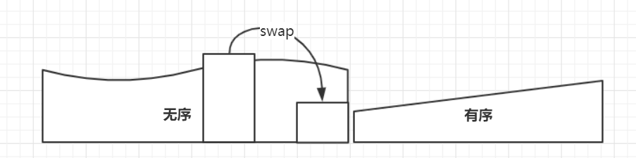
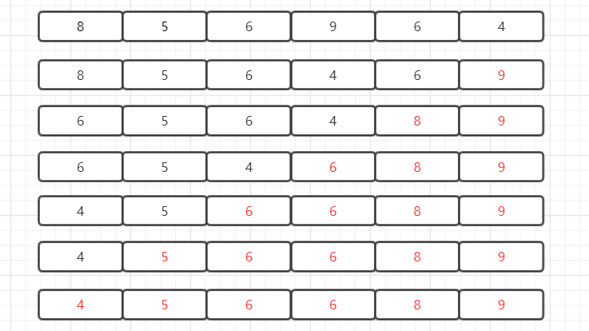

# 数据结构与算法-排序（一）

​		排序算法有很多种，此处仅介绍五种最经典通用的排序算法：冒泡排序、插入排序、选择排序、归并排序、快速排序。篇幅有限，本篇仅介绍前三种。

|          | 最好时间复杂度 | 最坏时间复杂度 | 平均时间复杂度 | 稳定排序 | 原地排序 |
| :------: | :------------: | :------------: | :------------: | :------: | :------: |
| 冒泡排序 |      O(n)      |     O(n^2)     |     O(n^2)     |    是    |    是    |
| 插入排序 |      O(n)      |     O(n^2)     |     O(n^2)     |    是    |    是    |
| 选择排序 |     O(n^2)     |     O(n^2)     |     O(n^2)     |    否    |    是    |
| 归并排序 |    O(nlogn)    |    O(nlogn)    |    O(nlogn)    |    是    |    否    |
| 快速排序 |      O(n)      |     O(n^2)     |    O(nlogn)    |    否    |    是    |


## 一、分析

​		既然排序算法有很多种，那么为了比较不同算法之间区别评价优劣，便需要从算法的时间消耗，空间消耗与稳定性三方面入手。


### 1.1 时间消耗

​		可以通过时间复杂度来分析算法的时间消耗，最好、最坏和平均时间复杂度都不可缺。同时，还要获知最好、最坏时间复杂度对应要排序的初始数据集的特点。因为数据的有序度不同，例如有的接近有序，有的完全无序，这对于排序的执行时间自然是有影响的，知道排序算法在不同数据下的性能表现有助相互对比分析。

​		另外，当计算时间复杂度时，默认n值很大，此时会忽略它的系数、低阶和常数，但当n比较小时便不可忽略。因此，在对同一阶时间复杂度的排序算法性能进行对比时，系数、低阶和常数便要考虑进来。

​		在排序过程中，会频繁进行比较与元素移动操作，在对排序算法进行效率分析时也应当考虑在内。


### 1.2 空间消耗

​		空间消耗可以通过空间复杂度来衡量。其中，对于空间复杂度为O(1)的排序算法，称为原地排序算法。


### 1.3 稳定性

​		除了时间复杂度与空间复杂度外，排序算法还有一个重要的分析指标，即稳定性，意思是如果待排序序列中存在数值相等的元素，排序结束后相等元素之间原有的顺序保持不变。举例来说，有一组序列 8， 5， 6， 9， 6， 4， 其中存在值相等的元素6，为便于区分，将前一个6记为6a，后一个6记为6b，即 8， 5， 6a， 9， 6b， 4 ， 若排序后两个6顺序没变，即 4， 5， 6a， 6b， 8， 9， 则称这种排序算法是稳定的排序算法，否则称为不稳定的排序算法。

​		需要注意的是，在某些业务场景中，稳定性是很重要的。例如，有一组学生信息序列，每个学生的信息包括学生学号与成绩。要求将学生成绩进行排序，对于成绩相同的学生按学号进行排序。当然，可以先对成绩进行排序，然后再针对相同成绩的学生进行学号排序，但这样的实现比较复杂。简单的，可以先对学号进行排序，再对成绩进行排序。若排序算法是稳定的，第二次的排序结束后相同成绩的学生已经是有序的。


## 二、简单排序算法简介

### 2.1 冒泡排序

​		不断遍历待排序序列，依次比较相邻元素大小，看是否满足大小关系要求。若不满足，则互换位置。如下图第一次遍历过程，首先，8与5比较，8比5大，互换位置，接着，8与6比较，互换，8与9比较，不变，9与6比较，互换，9与4比较，互换，第一次遍历结束，9归位。




​		可以发现，在一次遍历结束时，算法会将未排序（黑色数字表示）中的最大值移至未排序区间的末尾，接着将该元素并入已排序（红色数字表示）区域。一次冒泡会让至少一个元素移动到它应该在的位置，重复 n 次，就完成了 n 个数据的排序工作。




​		但是，当考察最好情况下（即待排序序列已经完全有序）算法表现时，会发现算法的效率不尽如人意。如下图所示，当第二次遍历结束时，序列已经实现有序，但算法本身却没有察觉，仍然继续遍历直至n次结束。事实上，如果在第三次遍历时，会发现此次遍历没有进行数据交换，说明序列本身已经实现有序，后续操作不必执行。要达到这一目的，只需引入一个标记位即可。




代码简单示例如下：

```java
public void bubbleSort(int[] a, int n){
    if(n <= 1) return;
	for(int i = 0; i < n; i++){
        boolean flag = false; //判断是否有数据交换
        for(int j = 0; j < n - i - 1; j++){
            if(a[j] > a[j+1]){ //不能写为>=
                int t = a[j];
                a[j] = a[j+1];
                a[j+1] = t;
                flag = true;
            }
        }
        if(!flag) break;
    }
}
```


​		如此，最好情况下仅需一次遍历，时间复杂度为O(n)，最坏情况下自然需要n次遍历，即O(n^2)。算法由内、外两层循环组成。内循环从前向后， 依次比较各对相邻元素，如有必要则将其交换。在内循环中，需要扫描和比较k - 1对元素，至多需要交换k - 1对元素。每一轮内循环至多需要执行2(k - 1)次基本操作。另外，外循环至多执行n - 1轮。因此，该算法的时间复杂度为O(n^2)。

​		冒泡排序只需要常量级的临时空间，是原地算法，同样也是稳定的排序算法。在冒泡排序中，只有逆序的元素才会进行互换。当然，如果将算法中if的判断条件改为'>='，便不再是稳定的算法了。


​		在冒泡排序结束之前，再看下下面这个例子。按照已经给出的排序算法，需要3次整体遍历，然而，可以发现后面部分数据（7，8，9）实际上已经是处于正确位置的，无需进行扫描的。如果有一种方法，在第一次遍历时便发现（7，8，9）已无需扫描，那么在后面的扫描交换过程只在前半部分进行，如此效率也能得以提升。




代码简单示例如下：

```java
//优化后的冒泡排序
public void bubbleSort(int[] a, int n){
    if(n <= 1) return;
    for(int i = 0; i < n; i++){
        int last = 0;
        for(int j = 0; j < n - i - 1; j++){
            if(a[j] > a[j+1]){
                int t = a[j];
                a[j] = a[j+1];
                a[j+1] = t;
                last = j + 1 + 1;
            }
        }
        n = last;
    }
}
```


### 2.2 插入排序

​		将待排序序列视为两个部分，左侧为有序区域（初始为空），右侧为无序区域（初始为全序列）。

1. 获取无序区域中的第一个元素e；
2. 在有序区域中找到值不大于e的最大位置k；
3. 根据k将元素e插入有序区域中；
4. 若无序区域长度大于0，回到1步重复操作，否则排序结束。

​		每经一次插入操作，有序区域长度加一，无序区域长度减一，直至无序区域长度为0，此时序列完成排序。




代码简单示例如下：

```java
public void insertionSort(int[] a, int n){
    if(n <= 1) return;
	for(int i = 1; i < n; i++){
        int v = a[i];
        int j = i - 1;
        for(; j >= 0; j--){
            if(a[j] > v){
                a[j+1] = a[j];
            } else {
                break;
            }
        }
        a[j+1] = v;
    }
}
```


​		示例如下，首先获取无序区域（黑色数字表示）第一个元素8，8在有序区域中位置是0，将8插入有序区域。接着，便是5的位置是0，5被划入有序区域，6的位置是1，6被划入有序区域，9的位置是3，9被划入有序区域，6的位置是2，6被划入有序区域，4的位置是0，4被划入有序区域，排序结束。




​		最好情况下，序列完全有序，每次迭代仅需要1次比较，0次交换，累计O(n)时间。最坏情况下，序列完全逆序，在第k次迭代时，需要O(k)次比较，1次交换，累计O(n^2)时间。平均情况下，假定各元素独立均匀分布，在完成插入第k（k从0计）个元素时，有序区域长度为k+1，此时该k+1个元素均有可能是刚刚插入的元素，概率值为1/(k + 1)，因此，在刚刚完成的这次迭代中，所花费时间的数学期望为
$$
{(r + (r - 1) + ... + 1 + 0) / (r + 1) + 1 = r / 2 + 1}
$$
于是，总体时间为O(n^2)。

​		插入排序是原地排序算法。操作的第2步可以保证它的稳定性。例如，上图中的5，6a，8，9，6b，4，其中，5，6a，8，9为有序区域，此时需找出值不大于6的最大位置2，即插入到前面出现元素的后面，在6a之后。


### 2.3 选择排序

​		将待排序序列视为两个部分，左侧为无序区域（初始为全序列），右侧为有序区域（初始为空）。

1. 遍历无序区域；
2. 找到无序区域中的最大值；
3. 将该最大值与无序区域最后一个元素交换；
4. 将无序区域最后一位元素划入有序区域；
5. 若无序区域长度大于0，回到1步重复操作，否则排序结束。

​		每经一次扫描交换，无序区域选出的最大值必然是有序区域的最小值，可保证第四步操作不会破坏有序区域的有序性。有序区域长度加一，无序区域长度减一，直至无序区域长度为0，此时序列完成排序。




代码简单示例如下：

```java
public void selectionSort(int[] a, int n){
    if(n <= 1) return;
	for(int i = n - 1; i > 0; i--){
        int v = a[i];
        int k = i;
        for(int j = i - 1; j >= 0; j--){
            if(a[j] > v){
                v = a[j];
                k = j;
            }
        }
        int t = a[i];
        a[i] = a[k];
        a[k] = t;
    }
}
```


​		示例如下，首先在无序区域（黑色数字表示）找到最大值9，将9与无序区域最后一个元素4交换，并将9划入有序区域（红色数字表示）。接着，便是8与6交换，8被划入有序区域，6与4交换，6被划入有序区域，6与4交换，6被划入有序区域，5与5交换，5被划入有序区域，4与4交换，4被划入有序区域，排序结束。




​		通过分析可见，选择排序的原理与冒泡排序类似，但优劣却是高下立判。原因在于，在每次扫描挑选最大元素时，冒泡排序需要进行O(n)次比较与O(n)次交换，而选择排序仅需要进行O(n)次比较与一次交换。

​		选择排序共迭代n次，在第k次迭代中查找最大值需O(n-k)，其他操作需O(1)，故总体复杂度为O(n^2)。尽管如此，选择排序的移动操作远远少于冒泡排序（而实际上，移动操作更加费时），O(n^2)的时间复杂度主要来自于元素比较。而若借用堆这种数据结构，可以实现在O(logn)时间完成最大值的查找，此时选择排序算法可以达到O(nlogn)的时间复杂度。

​		选择排序是原地算法，但却不是稳定的排序算法。每次迭代中要找出无序区域中的最大值，并和后面的元素交换位置，破坏了稳定性。例如，9， 6， 4， 8， 6这组数据，第一次找到最大元素9，与第二个6交换位置，那么两个6的顺序就变了，因此就不稳定了。
