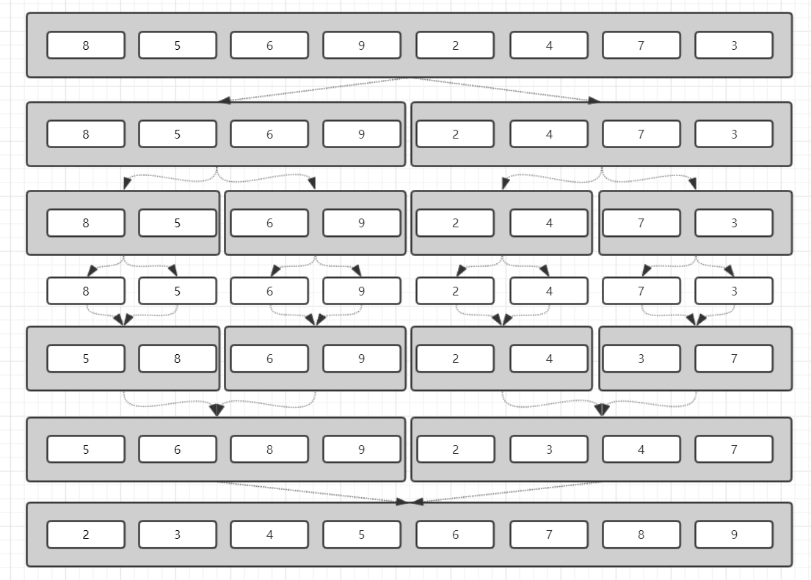
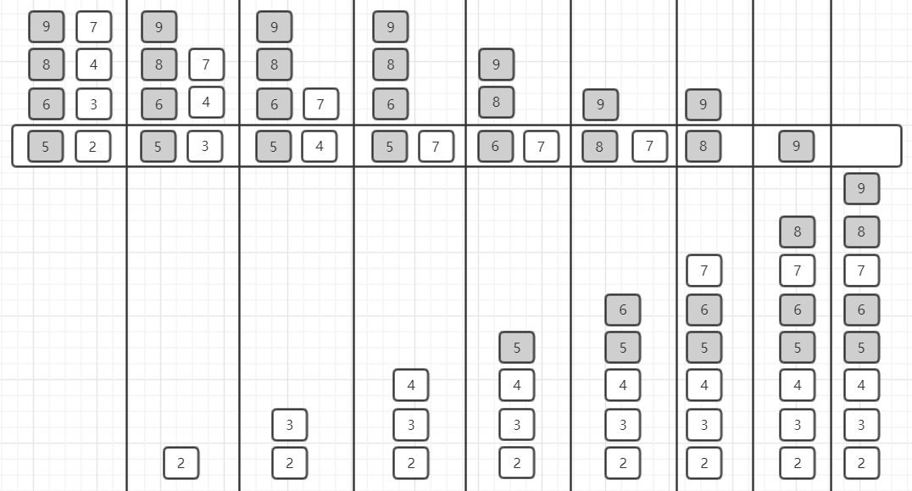
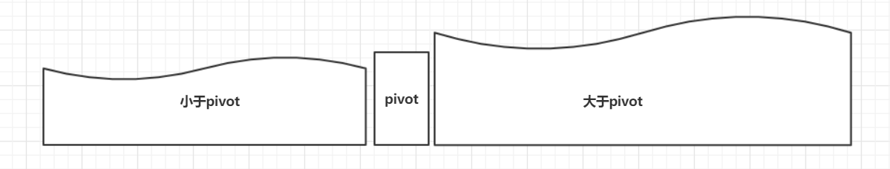
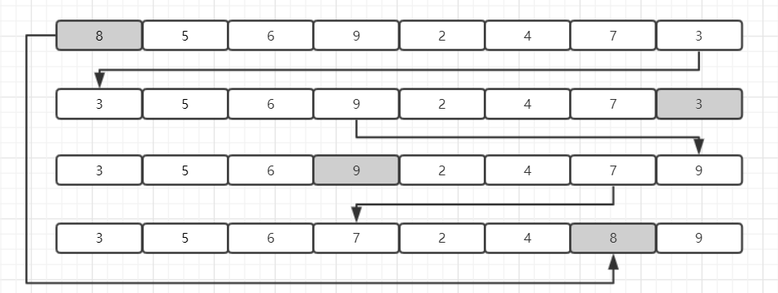

# 数据结构与算法-排序（二）

​		接上篇，继续介绍归并排序与快速排序。


## 三、简单排序算法简介

### 3.1 归并排序

​		归并排序使用的是分治策略，核心思想也比较简单。要排序一个序列，首先从中间将序列一分为二，然后对划分的前后两个序列进行排序，再将排序好的序列合而为一，这样原有的序列就已有序了。




​		可见，归并排序的核心在于合并有序序列。以下图为例，有两个待合并有序序列 5， 6， 8， 9， 与 2， 3， 4， 7。依次比较两序列中待确认的最小元素。首先，比较2与5,2比5小，2确认为序列第一个元素；比较3与5,3比5小，3确认为序列第二个元素；以此类推，直至7与8比较，7比8小，7确认为序列中元素，此时第二个序列为空，只需将第一个序列中元素按次序放入新序列中即可。




代码简单示例如下：

```java
public void mergeSort(int[] a, int lo, int hi){
    if (hi - lo < 2){
        return;
    }
    int mi = (lo + hi) >> 1;
    mergeSort(a, lo, mi);
    mergeSort(a, mi, hi);
    merge(a, lo, mi, hi);
}

public void merge(int[] a, int lo, int mi, int hi){
    int ls = mi - lo;
    int[] b = new int[ls];
    for(int i = 0; i < ls; i ++){
        b[i] = a[lo + i];
    }
    for(int i = lo, j = 0, k = mi; (j < ls || k < hi);){
        if(j < ls && (hi <= k || b[j] <= a[k])){
            a[i++] = b[j++];
        }
        if(k < hi && (ls <= j || a[k] < b[j])){
            a[i++] = a[k++];
        }
    }
}
```


​		假设对n个元素进行排序需要时间为T(n)，则T(n) = 2 * T(n/2) + n，简单计算后可得归并排序时间复杂度为O(logn)。

​		归并排序是稳定排序算法，由merge方法中序列合并时处理决定。但是由于在合并过程中需新建数组作为临时存储空间，因此归并排序并不是原地算法。事实上，额外需要的空间最大不会超过序列本身大小，故归并排序的空间复杂度为O(n)。


### 3.2 快速排序

​		与归并排序相同，快速排序也是使用分治策略，而与归并排序不同的是，快速排序的关键点在于分解，而归并排序的关键点在于合并。基本思路是：

1. 在待排序列中找到一个轴点pivot；
2. 遍历所有元素，将值大于pivot的元素放到右侧，小于pivot的元素放到左侧，等于pivot的元素放至中间；
3. 接着对左右序列分别回到1步骤，直至序列区间缩小为1。




​		之前提到，快速排序的关键点在于分解，分解的方式有许多种，此处介绍较简单的一种方式。如下图，首先，此处取第一个元素为轴点，lo=0，hi=7，从序列末端开始。3<8，将3复制至lo处，lo加一，接着从lo处开始递增检查至9处，发现9>8，将9复制至hi处，hi减一，接着从hi处开始递减检查至7处，发现7<8，将7复制至lo处，lo加一，接着再次从lo处开始递增检查至hi处，遍历结束，将pivot赋值至lo处。此时，lo左侧元素均小于pivot，hi右侧元素均大于pivot。




代码简单示例如下：

```java
public void quickSort(int[] a, int lo, int hi){
    if (hi - lo < 2){
        return;
    }
    int mi = partition(a, lo, hi - 1);
    quickSort(a, lo, mi);
    quickSort(a, mi + 1, hi);
}

public int partition(int[] a, int lo, int hi){
    int pivot = a[lo];
    while(lo < hi){
        while(lo < hi && pivot <= a[hi]){
            hi--;
        }
        a[lo] = a[hi];
        while(lo < hi && a[lo] <= pivot){
            lo++;
        }
        a[hi] = a[lo];
    }
    a[lo] = pivot;
    return lo;
}
```


​		快速排序的时间复杂度取决于pivot的选择。轴点的选择很重要。一般可选择起点或终点作为轴点，但可能由于序列分布特殊导致时间复杂度变化很大。可以采取随机选取或三点取中位数等方式减小最坏情况出现的概率。最好情况下，每次划分接近平均，即T(n) = 2 * T((n- 1）/ 2）+ n = O(logn)。最坏情况下，每次划分都很不均衡，即T(n) = T(n - 1) + T(0) + n = O(n^2)。平均情况下分析方式类似，为O(logn)。

​		快速排序是原地排序算法，但不是稳定的。

​		另外，关于快排算法，还有许多变种，后续有空细提。

